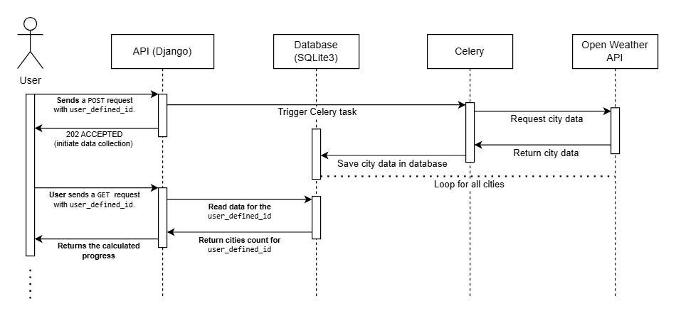

# Project Documentation

## Overview

This Django project is designed for a technical test by DevGrid and includes a web application that collects data from the Open Weather API.

- To use the application: `http://3.142.140.39:3000/`

- The API documentation with Swagger is available on the application's index page.

## Architecture

The project utilizes the following technologies: Back-End in Python and Django, SQLite database, Celery for asynchronous tasks, Redis as the message broker, and an AWS EC2 instance for hosting with Amazon Linux OS. The project is containerized using Docker, with Docker Compose for orchestration.

### Sequence Diagram



### Explanation of Decisions

1. **Back-End in Python and Django**:
   - **Python**: Python is a versatile and popular programming language known for its readability and ease of use. It has a vast ecosystem of libraries and frameworks, making it a strong choice for back-end development.
   - **Django**: Django is a high-level Python web framework that encourages rapid development and clean, pragmatic design. It comes with built-in features like an ORM (Object-Relational Mapping), authentication, and an admin panel, which speeds up development and reduces the need for external dependencies.

2. **SQLite Database**:
   - **SQLite**: SQLite is a lightweight, file-based database that is easy to set up and requires no separate server process. It's an excellent choice for projects that don’t require the complexity of a full-fledged database like PostgreSQL or MySQL, making it ideal for smaller projects or development environments.

3. **Celery for Asynchronous Tasks**:
   - **Celery**: Celery is a distributed task queue that allows you to run background jobs asynchronously, which is useful for tasks that are time-consuming and do not need to be completed immediately (e.g., sending emails, processing data). It helps improve the performance and responsiveness of your application by offloading these tasks.

4. **Redis as the Message Broker**:
   - **Redis**: Redis is an in-memory data structure store that is often used as a message broker for Celery. Its speed and efficiency make it ideal for handling the communication between Celery workers and the application, ensuring that tasks are managed effectively.

5. **AWS EC2 Instance for Hosting**:
   - **AWS EC2**: Amazon Web Services (AWS) EC2 is a scalable cloud computing service that allows you to run virtual servers on demand. Hosting your project on an EC2 instance provides flexibility, scalability, and reliability. The use of an Amazon Linux OS on EC2 is cost-effective and optimized for performance within AWS infrastructure.

6. **Docker and Docker Compose**:
   - **Docker**: Docker is a platform that allows you to package applications and their dependencies into containers. This ensures that the application runs consistently across different environments, from development to production, by isolating it from system-specific issues.
   - **Docker Compose**: Docker Compose is used for defining and running multi-container Docker applications. It simplifies the orchestration of your project’s services (e.g., Django, Celery, Redis) by managing them through a single configuration file, making deployment and scaling more straightforward.

## Project Structure

- **`weather_api_wrapper/`**: Main directory of the Django project.
  - **`settings.py`**: Main configuration file for Django.
  - **`celery.py`**: Configuration file for the Celery application.
  - **`urls.py`**: Global routing file for the project.
- **`weather/`**: API code for the project.
  - **`urls.py`**: Global routing of API URLs.
  - **`models.py`**: Model definitions.
  - **`views.py`**: Business logic and requirements.
  - **`tests.py`**: Unit tests.
- **`cities_list.py`**: List of city IDs, extracted from the appendix of the technical test.
- **`Dockerfile`**: Defines the Docker image for the application.
- **`docker-compose.yml`**: Configuration for orchestrating Docker containers.
- **`.env`**: Environment variables, with Open Weather API Key.
- **`run.sh`**: Script to start Docker containers.
- **`requirements.txt`**: List of Python dependencies for the project.

## API Key Configuration

   - Update the `.env` file with your Open Weather API key:

     ```bash
     OPEN_WEATHER_API_KEY={your_api_key}
     ```

---

## Docker Installation

### On Ubuntu

```bash
sudo apt-get update
sudo apt-get install apt-transport-https ca-certificates curl software-properties-common
curl -fsSL https://download.docker.com/linux/ubuntu/gpg | sudo apt-key add -
sudo add-apt-repository "deb [arch=amd64] https://download.docker.com/linux/ubuntu $(lsb_release -cs) stable"
sudo apt-get update
sudo apt-get install docker-ce
sudo systemctl status docker
docker --version
```

 **Optional: Add Your User to the Docker Group (to run Docker commands without `sudo`):**

   ```bash
   sudo usermod -aG docker $USER
   ```

   You will need to log out and log back in for this change to take effect.

### On Amazon Linux

```bash
sudo yum update -y
sudo amazon-linux-extras install docker
sudo service docker start
sudo docker --version
sudo service docker status
```

**Add Your User to the Docker Group (to run Docker commands without `sudo`):**

```bash
sudo usermod -aG docker $USER
```

## Running the Application

### Prerequisites:

- Python 3.10
- Redis Server
- Celery
- Docker
- Docker Compose

### Option 1: `run.sh`

The `run.sh` script is used to start the Docker containers easily.

- Make the `run.sh` script executable (only necessary once):

```bash
chmod +x run.sh
```

- After that, simply run the script.

```bash
sudo ./run.sh
```

### Option 2: Manual Commands

```bash
sudo docker-compose build
sudo docker-compose up -d
```

After that, your project will be available at `http://127.0.0.1:3000`

### Running Tests

To run the unit tests on the project's API, execute the following command while the application is running:

```bash
sudo docker exec weather_api_wrapper python3 manage.py test
```